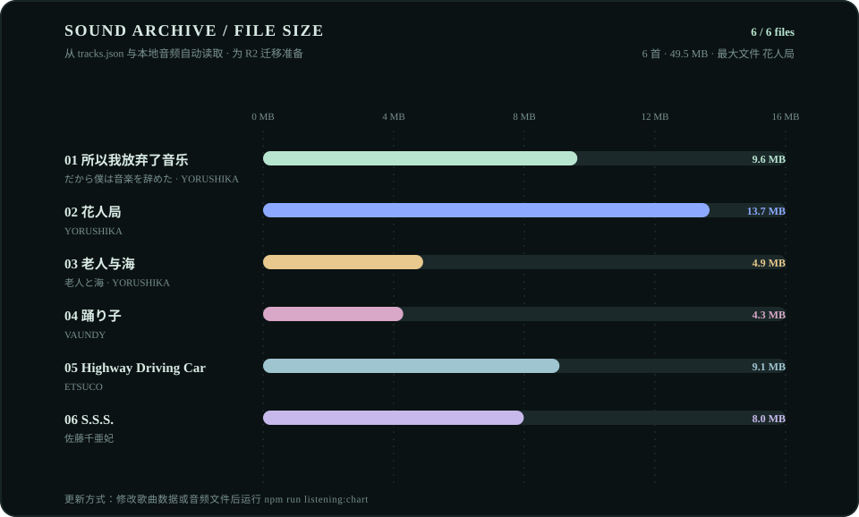

# Sakura Listening Room

<p align="center">
  <strong>Music for the quiet hours.</strong><br>
  一个以音乐为线索的个人博客：记录代码、游戏、阅读与生活。
</p>

<p align="center">
  <a href="https://sakura.luxe">在线访问</a> ·
  <a href="https://music.163.com/#/playlist?id=2203036705">网易云歌单</a> ·
  <a href="https://github.com/HanaViolet/MyWeb/issues">反馈问题</a>
</p>

<p align="center">
  
  
  
</p>

## ✨ 项目简介

这是 Sakura 的个人博客源码。网站由 Hexo 构建、Cloudflare Pages 发布，视觉上采用固定暗色、留白和唱片纹理，首页围绕 YORUSHIKA 等 J-pop 选曲展开。文章、资源、关于我和播放器共享同一套响应式布局，页面切换使用 Pjax，播放状态会在导航和登录返回后尽量恢复。

## 🎼 选曲档案图

<p align="center">
  
</p>

这张图展示歌单中每首音频的文件体积，数据直接从 [`source/_data/tracks.json`](source/_data/tracks.json) 和 `source/music/` 读取。它既能快速浏览这间 Listening Room 的声音库存，也能在迁移到 Cloudflare R2 前估算存储体积；不需要额外的统计权限或手工录入。

```bash
npm run listening:chart
```

新增歌曲、替换音频或修改标题后重新运行命令，README 图表就会同步更新。缺失的音频会标记为“音频文件未找到”，不会悄悄填入估算值。

## 🎧 音乐与内容

- `source/_data/tracks.json`：选曲元数据（日文标题、中文标题、专辑信息、短笺和音频路径）。
- `source/music/`：本地播放器使用的音频文件；只应提交你拥有或获准发布的音频，后续可迁移到 Cloudflare R2。
- `source/_data/netease-stats.json`：网易云公开接口同步的每周 / 总榜前 20 首歌曲；关于我页面会自动读取它。
- 网易云完整歌单：[Sakura 的收藏歌单](https://music.163.com/#/playlist?id=2203036705)。
- 网易云个人页：[Sakura 的听歌排行](https://music.163.com/#/user/home?id=1441471952)。
- `source/_posts/`：Markdown 文章；文章的 `cover` 会作为文章页顶部渐变背景。

## 🧩 主题结构

当前主题代码统一位于 [`themes/sakura/`](themes/sakura/)，站点入口配置为 [`_config.sakura.yml`](_config.sakura.yml)。旧的根目录注入文件已迁入主题目录；Git 变更中看到旧路径删除，是代码搬迁而不是功能删除。播放器、Pjax、搜索、Giscus 评论和移动端布局都由 Sakura 主题维护。

主题的渲染基础参考并改造自 [hexo-theme-butterfly 5.5.3](https://github.com/jerryc127/hexo-theme-butterfly)，原始 Apache-2.0 许可证和归属信息保留在 [`themes/sakura/LICENSE`](themes/sakura/LICENSE) 与 [`themes/sakura/NOTICE.md`](themes/sakura/NOTICE.md)。Sakura 的页面设计、音乐交互和适配代码为本项目新增内容。

## 📁 目录速览

```text
.
├─ source/                 # 文章、页面、图片与本地音乐
│  ├─ _posts/              # Markdown 文章
│  ├─ _data/tracks.json    # 播放器歌曲数据
│  └─ music/               # 音频文件（可迁移至 R2）
├─ themes/sakura/          # 独立主题：模板、样式、脚本与资源
├─ scripts/                # Hexo 扩展脚本
├─ tools/                  # README 图表等维护工具
├─ docs/                   # README 图表
├─ _config.yml             # Hexo 基础配置
├─ _config.sakura.yml      # Sakura 主题配置
└─ compress.py             # 图片/资源压缩工具
```

## 🛠️ 本地开发

环境要求：Node.js `>= 20.19.0`（Hexo 8）与 npm。

```bash
git clone https://github.com/HanaViolet/MyWeb.git
cd MyWeb
npm install
npm run server       # http://localhost:4000
```

常用命令：

```bash
npm run build         # 生成 public/
npm run clean         # 清理生成目录
npm run listening:chart # 从歌曲数据与音频文件生成 docs/listening-archive.svg
npm run netease:update  # 手动同步网易云周榜 / 总榜数据
python compress.py    # 按脚本说明压缩图片资源
```

新增文章：

```bash
npx hexo new post "文章标题"
```

文章需要封面时，将图片放入同名资源文件夹，并在 Front Matter 中设置 `cover: /img/your-cover.jpg`。提交前建议执行 `npm run clean; npm run build`，确认生成成功后再推送。

## 🔐 发布与隐私

Cloudflare Pages 负责从 GitHub 构建并发布站点，仓库本身不保存部署密钥。若将音频迁移到 R2，建议使用公开只读对象 URL，并把管理凭据放在 Cloudflare Secrets 中；不要把 API Token、私有歌单或未获授权的音频提交到公开仓库。

`.github/workflows/update-netease-stats.yml` 会每天按北京时间 00:17 请求网易云公开排行接口，更新 `source/_data/netease-stats.json` 并提交变更，Cloudflare Pages 随后自动重新构建。公开接口有时只返回榜单和排序分数、隐藏播放次数；这种情况下页面会明确显示“暂不可读”，不会用猜测值冒充听歌时长。

## 📄 许可证与致谢

本站原创文章、Sakura 页面设计和项目代码按仓库实际文件声明使用。主题中由 Butterfly 改造而来的渲染层继续遵循 Apache-2.0；第三方字体、图标、Busuanzi、Giscus 与 CDN 服务各自遵循其许可和服务条款，详见 [`themes/sakura/NOTICE.md`](themes/sakura/NOTICE.md)。感谢 Butterfly 社区提供的 Hexo 主题基础。
